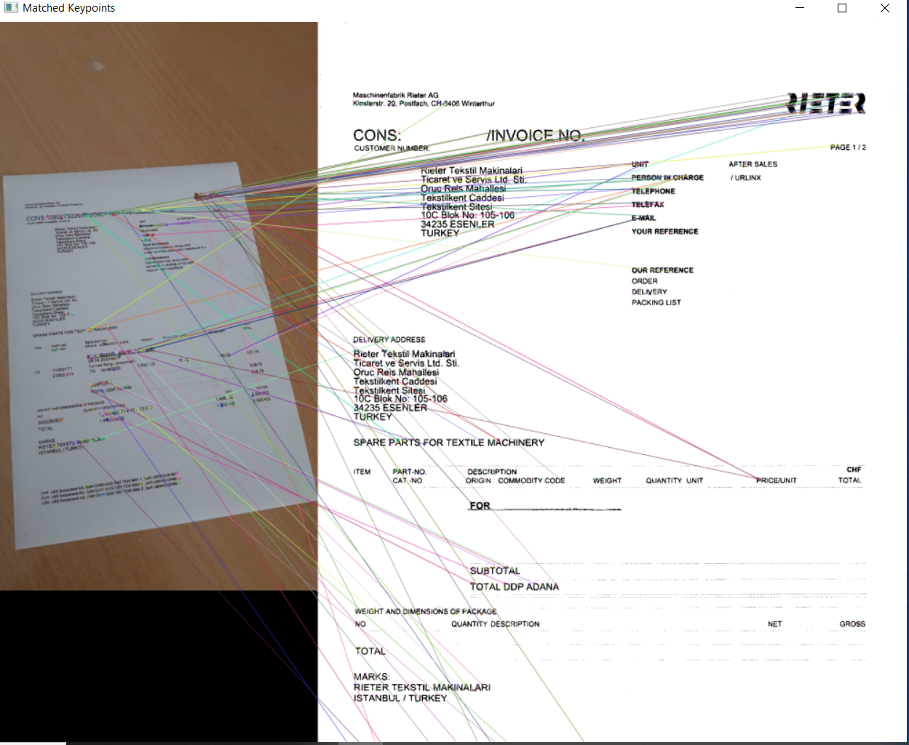
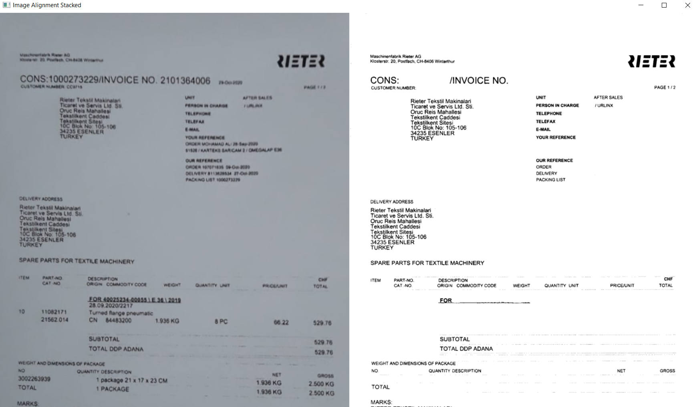
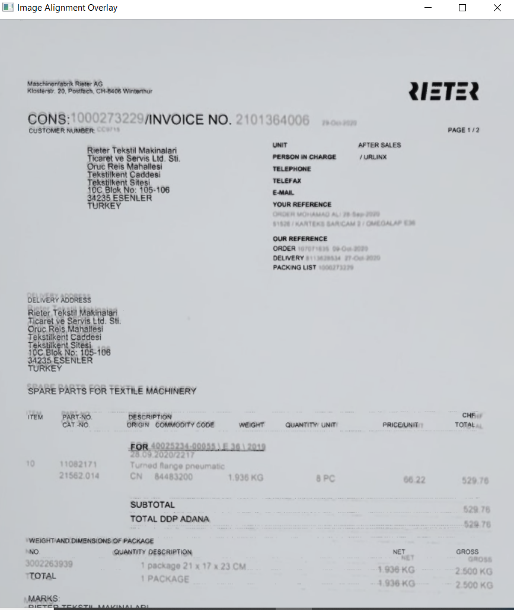
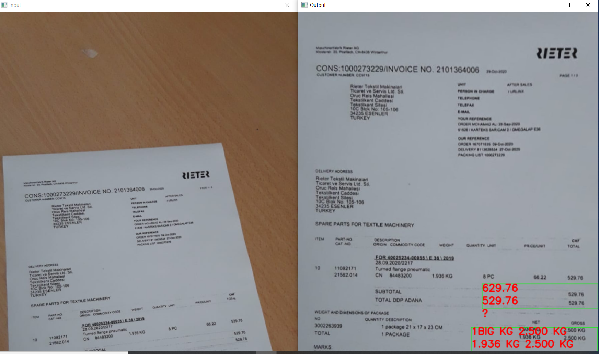

# Text-Detection
This project uses openCV to OCR a customs invoice
It reads the total values of given invoices.
Outputs shown below.

1. Image Alignment

2. Stacked Image Alignment

3. Overlayed Image Alignment

4. OCR Documentation

